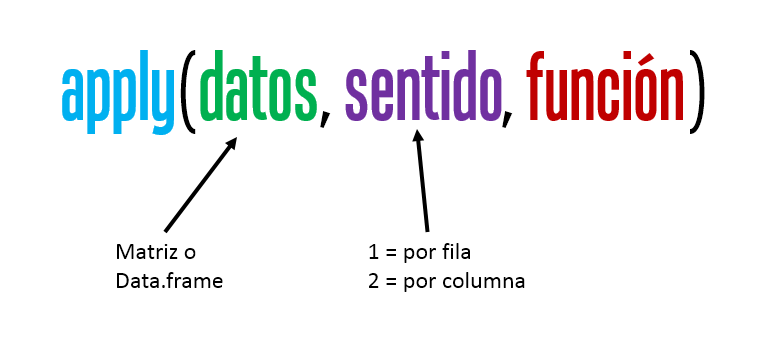
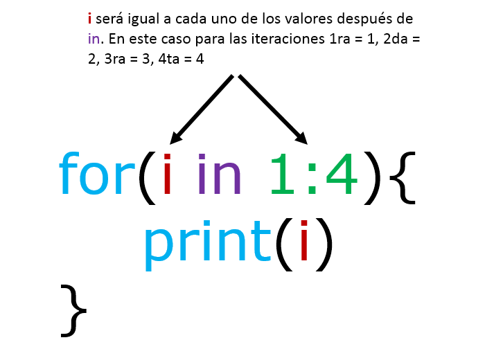
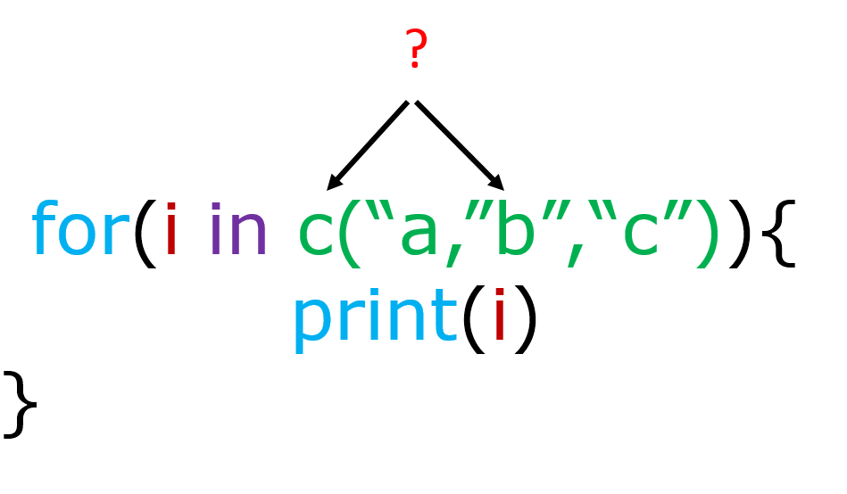

# Loops en R

('"Looping", "cycling", "iterating" or just replicating instructions')

Trabajaremos con conjunto de datos llamada iris, la base tiene información sobre el largo y ancho de sépalos y pétalos de 50 flores de tres especies de plantas.

```{r}
data(iris)
DT::datatable(iris)
```

## apply()

Aplicas instrucciones a filas o columnas de un data.frame o matriz.



<video width="320" height="240" controls>

<source src="images/apply_2.mp4" type="video/mp4">

</video>

Si queremos estimar la media de cada una de mis cuatro variables de la tabla iris entonces podría usar lo siguiente:

```{r}
mean(iris$Sepal.Length)

mean(iris$Sepal.Width)

mean(iris$Petal.Length)

mean(iris$Petal.Width)
```

**o**

```{r}
c(mean(iris$Sepal.Length), mean(iris$Sepal.Width), mean(iris$Petal.Length), mean(iris$Petal.Width))
```

**oo**

```{r}
colMeans(iris[,1:4])
```

**Pero podríamos usar `apply()`**

¿Porqué sale error o NA?

**1) Ahora quiero la raíz cuadrada de la media que previamente es elevada a la 5ta potencia**

**2) El resultado de la raíz cuadrada la quiero multiplicar por 5**

**3) Si el resultado es mayor a 100 que devuelva un 0**


## for()

Sirve para repetir n veces una o más instrucciones. La estructura es:

{width="547"}

{width="467"}

En el siguiente ejemplo usaremos for() para obtener un boxplot para cada variable de pétalo y sépalo.

**Solución 1.**

```{r}
par(mfrow=c(2,2))
boxplot(iris$Sepal.Length ~ iris$Species, ylab = "Sepal.Length",
        xlab = "Specie")
boxplot(iris$Sepal.Width ~ iris$Species, ylab = "Sepal.Width",
        xlab = "Specie")
boxplot(iris$Petal.Length ~ iris$Species, ylab = "Petal.Length",
        xlab = "Specie")
boxplot(iris$Petal.Width ~ iris$Species, ylab = "Petal.Width",
        xlab = "Specie")
```

**Solución 2.**

```{r}
par(mfrow=c(2,2))
for(i in 1:4){
  boxplot(iris[[i]] ~ iris$Species, ylab = names(iris)[i], xlab = "Specie")
}
```

Además, podemos crear **vectores, listas o data.frames**, pero previamente debemos crear un **objeto que va a almacenar** nuestra salida de cada iteración (repetición de instrucciones) y que debe tener las propiedades que queremos de salida.

**Vector**

```{r}
prueba <- vector()
for(i in 1:4){
  prueba[[i]] <- mean(iris[[i]])
}
prueba
```

**Data.frame**

```{r}
prueba <- data.frame(Especie = "", 
                     "MSepal.Length" = 0,
                     "SDSepal.Length" = 0)
prueba
# c("setosa", "versicolor", "virginica") = unique(iris$Species)
for(i in 1:3){
  i.1 <- iris[iris$Species == unique(iris$Species)[[i]],]
  prueba[i,] <- data.frame(Especie = as.character(unique(iris$Species)[[i]]), 
                     "MSepal.Length" = mean(i.1$Sepal.Length),
                     "SDSepal.Length" = sd(i.1$Sepal.Length))
}
prueba
```

**Lista**

```{r}
prueba <- list()
# c("setosa", "versicolor", "virginica") = unique(iris$Species)
for(i in 1:3){
  i.1 <- iris[iris$Species == unique(iris$Species)[[i]],]
  prueba[[i]] <- data.frame(Especie = as.character(unique(iris$Species)[[i]]), 
                     "MSepal.Length" = mean(i.1$Sepal.Length),
                     "SDSepal.Length" = sd(i.1$Sepal.Length))
}
prueba
```

```{r}
prueba <- do.call(rbind, prueba)
prueba
```
