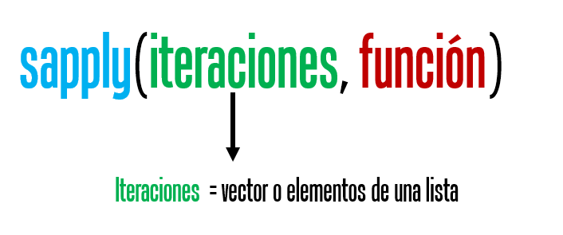
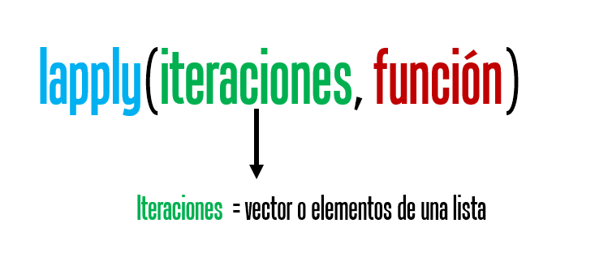

# Loops en R. Funciones base de R

('"Looping", "cycling", "iterating" or just replicating instructions')

Trabajaremos con conjunto de datos llamada iris, la base tiene información sobre el largo y ancho de sépalos y pétalos de 50 flores de tres especies de plantas.

```{r}
data(iris)
DT::datatable(iris)
```

## apply()

Aplicas instrucciones a filas o columnas de un data.frame o matriz.

{width="547"}

<video width="500" height="400" controls>

<source src="images/apply_2.mp4" type="video/mp4">

</video>

Si queremos estimar la media de cada una de mis cuatro variables de la tabla iris entonces podría usar lo siguiente:

```{r}
mean(iris$Sepal.Length)

mean(iris$Sepal.Width)

mean(iris$Petal.Length)

mean(iris$Petal.Width)
```

**o**

```{r}
c(mean(iris$Sepal.Length), mean(iris$Sepal.Width), mean(iris$Petal.Length), mean(iris$Petal.Width))
```

**oo**

```{r}
colMeans(iris[,1:4])
```

**Pero podríamos usar `apply()`**

```{r}
apply(iris, 2, mean)
```

**¿Porqué sale error o NA?**

**Para ir tomando ritmo resolvamos los siguientes ejercicios:**

**1) Ahora quiero la raíz cuadrada de la media que previamente es elevada a la 5ta potencia**

```{r}
apply(iris[,1:4], 2, function(x){
  x.1 <- sqrt(mean(x)^5)
})
```

**2) El resultado de la raíz cuadrada la quiero multiplicar por 15 y dividir entre 2**

**3) Si el resultado es mayor a 1000 que devuelva un 0**

## for()

Sirve para repetir n veces una o más instrucciones. La estructura es:

{width="547"}

{width="467"}

En el siguiente ejemplo usaremos `for()` para obtener un boxplot para cada variable de pétalo y sépalo.

**Solución 1.**

```{r}
par(mfrow=c(2,2))
boxplot(iris$Sepal.Length ~ iris$Species, ylab = "Sepal.Length",
        xlab = "Specie")
boxplot(iris$Sepal.Width ~ iris$Species, ylab = "Sepal.Width",
        xlab = "Specie")
boxplot(iris$Petal.Length ~ iris$Species, ylab = "Petal.Length",
        xlab = "Specie")
boxplot(iris$Petal.Width ~ iris$Species, ylab = "Petal.Width",
        xlab = "Specie")
```

**Solución 2.**

```{r}
par(mfrow=c(2,2))
for(i in 1:4){
  boxplot(iris[[i]] ~ iris$Species, ylab = names(iris)[i], xlab = "Specie")
}
```

Además, podemos crear **vectores, listas o data.frames**, pero previamente debemos crear un **objeto que va a almacenar** nuestra salida de cada iteración (repetición de instrucciones) y que debe tener las propiedades que queremos de salida.

**Vector**

```{r}
prueba <- vector()
for(i in 1:4){
  prueba[[i]] <- mean(iris[[i]])
}
prueba
```

**Data.frame**

```{r}
prueba <- data.frame(Especie = "", 
                     "MSepal.Length" = 0,
                     "SDSepal.Length" = 0)
prueba
# c("setosa", "versicolor", "virginica") = unique(iris$Species)
for(i in 1:3){
  i.1 <- iris[iris$Species == unique(iris$Species)[[i]],]
  prueba[i,] <- data.frame(Especie = as.character(unique(iris$Species)[[i]]), 
                     "MSepal.Length" = mean(i.1$Sepal.Length),
                     "SDSepal.Length" = sd(i.1$Sepal.Length))
}
prueba
```

**Lista**

```{r}
prueba <- list()
# c("setosa", "versicolor", "virginica") = unique(iris$Species)
for(i in 1:3){
  i.1 <- iris[iris$Species == unique(iris$Species)[[i]],]
  prueba[[i]] <- data.frame(Especie = as.character(unique(iris$Species)[[i]]), 
                     "MSepal.Length" = mean(i.1$Sepal.Length),
                     "SDSepal.Length" = sd(i.1$Sepal.Length))
}
prueba
```

Para colapsar la lista en un unico objeto podemos usar la función `do.call()`

```{r}
prueba <- do.call(rbind, prueba)
prueba
```


## sapply()
sapply trabaja con vectores o listas y las salidas usuales pueden ser matrices, con varios array, una lista o un vector, es decir, puede hacer de todo!

{width="547"}


Veamos algunas de sus aplicaciones más comunes.

**1.** Obtener un vector numérico. Estimar la media para cada variable del conjunto de datos iris.

```{r}
sapply(1:4, function(x){mean(iris[[x]])})
```

**2.** Obtener una matriz con arrays que puedes transformar a data.frame. Ojo el resultado de iteración lo agrega en una "columna". 

```{r}
sapply(1:3, function(x){
  x.1 <- iris[iris$Species == unique(iris$Species)[[x]],]
  x.1 <- c("Especie" = as.character(unique(iris$Species)[[x]]), 
           "MSepal.Length" = mean(x.1$Sepal.Length),
           "SDSepal.Length" = sd(x.1$Sepal.Length))
  return(x.1)
})
```


Si quiero tener una salida más amigable como un data.frame tendríamos que usar otras funciones, por ejemplo:

```{r}
library(magrittr)# para usar %>%
sapply(1:3, function(x){
  x.1 <- iris[iris$Species == unique(iris$Species)[[x]],]
  x.1 <- c("Especie" = as.character(unique(iris$Species)[[x]]), 
           "MSepal.Length" = mean(x.1$Sepal.Length),
           "SDSepal.Length" = sd(x.1$Sepal.Length))
  return(x.1)
}) %>% as.data.frame() %>% t() %>% as.data.frame()
```


**3.** Obtener una lista. Se necesita que las salidas tengan dimensiones distintas, de lo contrario lo juntara en una matriz. 

```{r}
sapply(3:9, seq)
```

```{r}
sapply(1:3, function(x){
  x.1 <- iris[iris$Species == unique(iris$Species)[[x]],]
  if(unique(x.1$Species) == "setosa"){
  x.1 <- c("Especie" = as.character(unique(iris$Species)[[x]]), 
           "MSepal.Length" = mean(x.1$Sepal.Length))  
  } else {
  x.1 <- c("Especie" = as.character(unique(iris$Species)[[x]]), 
           "MSepal.Length" = mean(x.1$Sepal.Length),
           "SDSepal.Length" = sd(x.1$Sepal.Length))  
  }
  
  return(x.1)
})
```


## lapply()

La función lapply es una de las funciones más usadas en R, permite realizar iteraciones sobre una lista, array o vector y devuelve siempre una lista. Esto tiene varias ventajas, por ejemplo, que puedes guardar cualquier tipo clase de R.


{width="547"}


{width="547"}


**Vector**
```{r}
lapply(1:3, function(x){
  x.1 <- iris[iris$Species == unique(iris$Species)[[x]],]
  
  x.1 <- c("Especie" = as.character(unique(iris$Species)[[x]]), 
           "MSepal.Length" = mean(x.1$Sepal.Length),
           "SDSepal.Length" = sd(x.1$Sepal.Length))  
  
  return(x.1)
})

```

**Data.frame**
```{r}
lapply(1:3, function(x){
  x.1 <- iris[iris$Species == unique(iris$Species)[[x]],]
  x.1 <- data.frame("Especie" = as.character(unique(iris$Species)[[x]]), 
           "MSepal.Length" = mean(x.1$Sepal.Length),
           "SDSepal.Length" = sd(x.1$Sepal.Length))  
  
  return(x.1)
})
```
  
  
**lista**
```{r}
lapply(1:3, function(x){
  x.1 <- iris[iris$Species == unique(iris$Species)[[x]],]
  
  x.1 <- list("Especie" = as.character(unique(iris$Species)[[x]]), 
           "MSepal.Length" = mean(x.1$Sepal.Length),
           "SDSepal.Length" = sd(x.1$Sepal.Length))  
  
  return(x.1)
})
```


