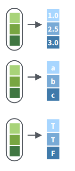

# Loops en R. Paralelizar

Existen diversas estrategias de paralelización y paquetes que ayudan a aplicarlos en R (e.g., parallel, foreach). En esta sección usaremos el paquete `future` que trata de simplificar la aplicación de la paralelización en R para objetos de distintas clases. El paquete future tiene diversas estrategias de paralelización que pueden interactuar con la mayoría de las funciones y paquetes de R.

{width="300"}

Entre las estrategias principales se encuentran las siguientes:

{width="547"}

Las dos estrategias más populares son multicore y multiprocess, sin embargo, multicore solo está disponible para Linux.

**Secuencial**

{width="547"}

**Multisession vs Multicore**

{width="547"}


## Multisession

**Paso 0**. Instalar y abrir el paquete future

```{r echo=FALSE}
library(purrr)
library(magrittr)
library(future)
```


```{r eval=FALSE}
install.packages("future", dependencies = TRUE)
library(future)
```


**Paso 1**. Determinar cuántos cores o workers están disponibles, en este ejemplo usaremos la función nativa del paquete **future** llamada `availableCores()`:

```{r}
availableCores()

availableCores()/2
availableCores()-2

```


**Paso 2**. Correr la estrategia multisesssion usando la función `plan()`

```{r}
plan(strategy = multisession, gc = TRUE, workers = 4)
```


**Paso 3**. Cerrar el multisession

Opción 1

```{r}
plan(sequential)
```

Opción 2

```{r eval=FALSE}
a <- ps::ps()
a <- a[which(a$name =="Rscript.exe"),1]

for(i in a){
  tools::pskill(i)
}
```

## Paquete furrr

Seguiremos usando el conjunto de datos llamado **iris**:

```{r}
data(iris)
DT::datatable(iris)
```

## future_map()

La función `future_map` es el simil de `map`. La función permite realizar iteraciones sobre una *lista, array o vector* y devuelve siempre una lista. Esto tiene varias ventajas, por ejemplo, que puedes guardar cualquier clase de R.

{width="547"}

{width="547"}

**Abrimos future y furrr, y escogemos una estrategia de paralelización**

```{r}
library(furrr)
library(future)
```

```{r}
plan(strategy = multisession, gc = TRUE, workers = 4)
```

**Vector como iteración**

```{r}
entrada <- 1:3
future_map(entrada, function(x){
  x.1 <- iris[iris$Species == unique(iris$Species)[[x]],]
  
  x.1 <- c("Especie" = as.character(unique(iris$Species)[[x]]), 
           "MSepal.Length" = mean(x.1$Sepal.Length),
           "SDSepal.Length" = sd(x.1$Sepal.Length))  
  
  return(x.1)
})
```

**lista como iteración**

Imaginemos que previamente hice un proceso donde separé las filas de cada especie y las guardé por separado en una lista.

```{r}
entrada <- iris %>% split(iris$Species)
names(entrada)
class(entrada)
```

Ahora la lista tiene tres data.frames con los datos de cada especie y la usaremos como entrada en la función `future_map()`. La lista tiene 3 elementos por lo que hará 3 iteraciones. En la iteración 1 tomará el primer data.frame de la lista, en la iteración 2 el segundo data.frame de la lista y en la iteración 3 tomará el tercer data.frame de la lista.

```{r}
ejemplo <- future_map(entrada, function(x){
  x.1 <- data.frame("Especie" = as.character(unique(x$Species)), 
           "MSepal.Length" = mean(x$Sepal.Length),
           "SDSepal.Length" = sd(x$Sepal.Length))  
  return(x.1)
})

ejemplo
```

**Colapsar la lista**

Ya que la lista de salida tiene data.frames con columnas con el mismo nombre podemos colapsarlos en un único data.frame usando la función do.call() y rbind(), la ultima indica de que forma se puede colapsar la lista en este caso rbind indica que las apile por filas, de tal forma que las columnas se mantienen integras y lo único que incrementa son las filas.

{width="547"}

{width="547"}

Antes es importante quitar los NULL. En ocasiones cuando algo no ocurre como deseamos en lugar de dejar que falle el loop guardamos el resultado como un NULL, así sabemos que los NULL dentro de nuestra lista son errores. Por ejemplo, supongamos que no queremos tener información de setosa porque sabemos que la información es incorrecta, así que aplicaremos una iteración y cuando lleguemos a esa especie devolverá un NULL.

```{r}
ejemplo <- future_map(entrada, function(x){
  if(unique(x$Species) == "setosa"){
    x.1 <- NULL
  } else {
  x.1 <- data.frame("Especie" = as.character(unique(x$Species)), 
           "MSepal.Length" = mean(x$Sepal.Length),
           "SDSepal.Length" = sd(x$Sepal.Length))    
  }
  
  return(x.1)
})
ejemplo
```

Ahora antes de hacer un `do.call()` necesitamos quitar el elemento NULL de nuestra lista. En este ejemplo es sencillo porque tenemos solo tres elementos, pero imaginemos su importancia cuando tengamos docenas, cientos o miles de elementos en nuestra lista.

Para quitar los NULL podemos recurrir a las funciones base de R:

```{r}
Filter(Negate(is.null), ejemplo)
```

O podemos usar la función `compact` de purrr

```{r}
purrr::compact(ejemplo)
```

```{r}
ejemplo <- purrr::compact(ejemplo)
do.call(rbind, ejemplo)
```

También podríamos colapsar la lista por columnas usando la función cbind, de tal forma que la única fila que tenemos se queda integra y lo que cambia es el no. de columnas.

```{r}
do.call(cbind, ejemplo)
```

**Cerrar la paralelización**

```{r eval=FALSE}
a <- ps::ps()
a <- a[which(a$name =="Rscript.exe"),1]

for(i in a){
  tools::pskill(i)
}
```


```{r echo=FALSE}
plan(sequential)
```


## map_dfr y map_dfc

Para ahorrarnos el paso de usar la función `do.call()` para colapsar las listas en un data.frame podemos usar las funciones `future_map_dfr()` y `future_map_dfc()`.

Es igual a la función future_map (i.e., tiene la misma estructura y trabaja con vectores, listas, arrays) pero la salida siempre es un **data.frame** lo que implica que en las instrucciones que aplicas en cada iteración el resultado siempre debe ser un **data.frame**. Si la salida es un vector numérico, un vector de caracteres, una lista, array u otra clase entonces te marcará un error.

**Abrimos future y furrr, y escogemos una estrategia de paralelización**

```{r}
library(furrr)
library(future)
```

```{r}
plan(strategy = multisession, gc = TRUE, workers = 4)
```

#### **future_map_dfr()**

En nuestro ejemplo anterior, esta función sustituye el `do.call(rbind, ejemplo)`. **Nota**. Dejaremos setosa.

{width="200"}

**Usando una lista**

```{r}
future_map_dfr(entrada, function(x){
  x.1 <- data.frame("Especie" = as.character(unique(x$Species)), 
           "MSepal.Length" = mean(x$Sepal.Length),
           "SDSepal.Length" = sd(x$Sepal.Length))  
  return(x.1)
})
```

**Usando un vector**

```{r}
future_map_dfr(1:3, function(x){
  x.1 <- iris[iris$Species == unique(iris$Species)[[x]],]
  
  x.1 <- c("Especie" = as.character(unique(iris$Species)[[x]]), 
           "MSepal.Length" = mean(x.1$Sepal.Length),
           "SDSepal.Length" = sd(x.1$Sepal.Length))  
  
  return(x.1)
})
```

### **future_map_dfc()**

En nuestro ejemplo anterior, esta función sustituye el `do.call(cbind, ejemplo)`.

{width="200"}

**Usando una lista**

```{r}
future_map_dfc(entrada, function(x){
  x.1 <- data.frame("Especie" = as.character(unique(x$Species)), 
           "MSepal.Length" = mean(x$Sepal.Length),
           "SDSepal.Length" = sd(x$Sepal.Length))  
  return(x.1)
})

```

**Usando un vector**

```{r}
future_map_dfc(1:3, function(x){
  x.1 <- iris[iris$Species == unique(iris$Species)[[x]],]
  
  x.1 <- c("Especie" = as.character(unique(iris$Species)[[x]]), 
           "MSepal.Length" = mean(x.1$Sepal.Length),
           "SDSepal.Length" = sd(x.1$Sepal.Length))  
  
  return(x.1)
})
```

**¿Y si tenemos NULL de salida o un error en el proceso?**

## future_map_dbl,future_ map_chr y future_map_lgl

Este grupo de funciones realiza iteraciones sobre una *lista, array o vector* y devuelve **siempre un vector** numérico (map_dbl), carácter (map_chr) o lógico (map_lgl).

{width="200"}

### **future_map_dbl()**

```{r}
future_map_dbl(1:4, function(x){
  x.1 <- sqrt(mean(iris[[x]])^5)
  return(x.1)
})
```

### **future_map_chr()**

```{r}
future_map_chr(entrada, function(x){
  x.1 <- unique(as.character(unique(x$Species)))
  return(x.1)
})
```

### **future_map_lgl()**

```{r}
future_map_lgl(entrada, function(x){
  x.1 <- unique(as.character(unique(x$Species))) == "setosa"
  return(x.1)
})
```


## Incluir una condicional para detectar posibles errores

```{r}
prueba <- tryCatch(future_map_lgl(entrada, function(x){
  x.1 <- unique(as.character(unique(x$Species))) == "setosa"
  
  if(inherits(x.1, "error")){
  # Si existe un error primero cierro los sub procesos
  a <- ps::ps()
  a <- a[which(a$name =="Rscript.exe"),1]
  for(i in a){
    tools::pskill(i)
  }
  #Despues detengo el loop
 stop("oh error") 
}
  
  return(x.1)
}), error = function(err)err)

  if(inherits(prueba, "error")){
  #Si es parte de una función sirve guardar un posible error con tryCatch
  # Si existe un error primero cierro los sub procesos
  a <- ps::ps()
  a <- a[which(a$name =="Rscript.exe"),1]
  for(i in a){
    tools::pskill(i)
  }
  #Despues detengo el loop
 stop("oh error") 
}

```

**Cerrar la paralelización**

```{r eval=FALSE}
a <- ps::ps()
a <- a[which(a$name =="Rscript.exe"),1]

for(i in a){
  tools::pskill(i)
}
```

```{r echo=FALSE}
plan(sequential)
```

