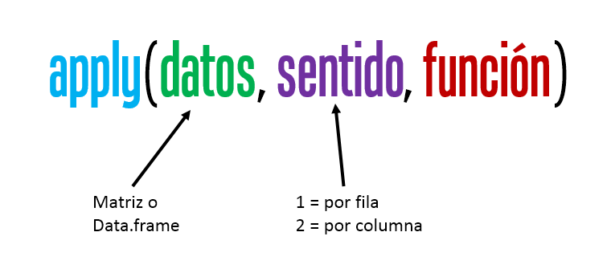
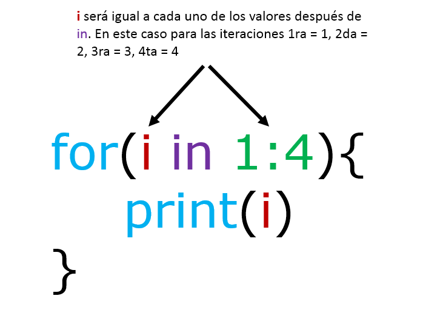

# Loops en R

('"Looping", "cycling", "iterating" or just replicating instructions')

Trabajaremos con conjunto de datos llamada iris, la base tiene información sobre el largo y ancho de sépalos y pétalos de 50 flores de tres especies de plantas.


```r
data(iris)
DT::datatable(iris)
```

```{=html}
<div id="htmlwidget-5276333f736edc88ddfd" style="width:100%;height:auto;" class="datatables html-widget"></div>
<script type="application/json" data-for="htmlwidget-5276333f736edc88ddfd">{"x":{"filter":"none","data":[["1","2","3","4","5","6","7","8","9","10","11","12","13","14","15","16","17","18","19","20","21","22","23","24","25","26","27","28","29","30","31","32","33","34","35","36","37","38","39","40","41","42","43","44","45","46","47","48","49","50","51","52","53","54","55","56","57","58","59","60","61","62","63","64","65","66","67","68","69","70","71","72","73","74","75","76","77","78","79","80","81","82","83","84","85","86","87","88","89","90","91","92","93","94","95","96","97","98","99","100","101","102","103","104","105","106","107","108","109","110","111","112","113","114","115","116","117","118","119","120","121","122","123","124","125","126","127","128","129","130","131","132","133","134","135","136","137","138","139","140","141","142","143","144","145","146","147","148","149","150"],[5.1,4.9,4.7,4.6,5,5.4,4.6,5,4.4,4.9,5.4,4.8,4.8,4.3,5.8,5.7,5.4,5.1,5.7,5.1,5.4,5.1,4.6,5.1,4.8,5,5,5.2,5.2,4.7,4.8,5.4,5.2,5.5,4.9,5,5.5,4.9,4.4,5.1,5,4.5,4.4,5,5.1,4.8,5.1,4.6,5.3,5,7,6.4,6.9,5.5,6.5,5.7,6.3,4.9,6.6,5.2,5,5.9,6,6.1,5.6,6.7,5.6,5.8,6.2,5.6,5.9,6.1,6.3,6.1,6.4,6.6,6.8,6.7,6,5.7,5.5,5.5,5.8,6,5.4,6,6.7,6.3,5.6,5.5,5.5,6.1,5.8,5,5.6,5.7,5.7,6.2,5.1,5.7,6.3,5.8,7.1,6.3,6.5,7.6,4.9,7.3,6.7,7.2,6.5,6.4,6.8,5.7,5.8,6.4,6.5,7.7,7.7,6,6.9,5.6,7.7,6.3,6.7,7.2,6.2,6.1,6.4,7.2,7.4,7.9,6.4,6.3,6.1,7.7,6.3,6.4,6,6.9,6.7,6.9,5.8,6.8,6.7,6.7,6.3,6.5,6.2,5.9],[3.5,3,3.2,3.1,3.6,3.9,3.4,3.4,2.9,3.1,3.7,3.4,3,3,4,4.4,3.9,3.5,3.8,3.8,3.4,3.7,3.6,3.3,3.4,3,3.4,3.5,3.4,3.2,3.1,3.4,4.1,4.2,3.1,3.2,3.5,3.6,3,3.4,3.5,2.3,3.2,3.5,3.8,3,3.8,3.2,3.7,3.3,3.2,3.2,3.1,2.3,2.8,2.8,3.3,2.4,2.9,2.7,2,3,2.2,2.9,2.9,3.1,3,2.7,2.2,2.5,3.2,2.8,2.5,2.8,2.9,3,2.8,3,2.9,2.6,2.4,2.4,2.7,2.7,3,3.4,3.1,2.3,3,2.5,2.6,3,2.6,2.3,2.7,3,2.9,2.9,2.5,2.8,3.3,2.7,3,2.9,3,3,2.5,2.9,2.5,3.6,3.2,2.7,3,2.5,2.8,3.2,3,3.8,2.6,2.2,3.2,2.8,2.8,2.7,3.3,3.2,2.8,3,2.8,3,2.8,3.8,2.8,2.8,2.6,3,3.4,3.1,3,3.1,3.1,3.1,2.7,3.2,3.3,3,2.5,3,3.4,3],[1.4,1.4,1.3,1.5,1.4,1.7,1.4,1.5,1.4,1.5,1.5,1.6,1.4,1.1,1.2,1.5,1.3,1.4,1.7,1.5,1.7,1.5,1,1.7,1.9,1.6,1.6,1.5,1.4,1.6,1.6,1.5,1.5,1.4,1.5,1.2,1.3,1.4,1.3,1.5,1.3,1.3,1.3,1.6,1.9,1.4,1.6,1.4,1.5,1.4,4.7,4.5,4.9,4,4.6,4.5,4.7,3.3,4.6,3.9,3.5,4.2,4,4.7,3.6,4.4,4.5,4.1,4.5,3.9,4.8,4,4.9,4.7,4.3,4.4,4.8,5,4.5,3.5,3.8,3.7,3.9,5.1,4.5,4.5,4.7,4.4,4.1,4,4.4,4.6,4,3.3,4.2,4.2,4.2,4.3,3,4.1,6,5.1,5.9,5.6,5.8,6.6,4.5,6.3,5.8,6.1,5.1,5.3,5.5,5,5.1,5.3,5.5,6.7,6.9,5,5.7,4.9,6.7,4.9,5.7,6,4.8,4.9,5.6,5.8,6.1,6.4,5.6,5.1,5.6,6.1,5.6,5.5,4.8,5.4,5.6,5.1,5.1,5.9,5.7,5.2,5,5.2,5.4,5.1],[0.2,0.2,0.2,0.2,0.2,0.4,0.3,0.2,0.2,0.1,0.2,0.2,0.1,0.1,0.2,0.4,0.4,0.3,0.3,0.3,0.2,0.4,0.2,0.5,0.2,0.2,0.4,0.2,0.2,0.2,0.2,0.4,0.1,0.2,0.2,0.2,0.2,0.1,0.2,0.2,0.3,0.3,0.2,0.6,0.4,0.3,0.2,0.2,0.2,0.2,1.4,1.5,1.5,1.3,1.5,1.3,1.6,1,1.3,1.4,1,1.5,1,1.4,1.3,1.4,1.5,1,1.5,1.1,1.8,1.3,1.5,1.2,1.3,1.4,1.4,1.7,1.5,1,1.1,1,1.2,1.6,1.5,1.6,1.5,1.3,1.3,1.3,1.2,1.4,1.2,1,1.3,1.2,1.3,1.3,1.1,1.3,2.5,1.9,2.1,1.8,2.2,2.1,1.7,1.8,1.8,2.5,2,1.9,2.1,2,2.4,2.3,1.8,2.2,2.3,1.5,2.3,2,2,1.8,2.1,1.8,1.8,1.8,2.1,1.6,1.9,2,2.2,1.5,1.4,2.3,2.4,1.8,1.8,2.1,2.4,2.3,1.9,2.3,2.5,2.3,1.9,2,2.3,1.8],["setosa","setosa","setosa","setosa","setosa","setosa","setosa","setosa","setosa","setosa","setosa","setosa","setosa","setosa","setosa","setosa","setosa","setosa","setosa","setosa","setosa","setosa","setosa","setosa","setosa","setosa","setosa","setosa","setosa","setosa","setosa","setosa","setosa","setosa","setosa","setosa","setosa","setosa","setosa","setosa","setosa","setosa","setosa","setosa","setosa","setosa","setosa","setosa","setosa","setosa","versicolor","versicolor","versicolor","versicolor","versicolor","versicolor","versicolor","versicolor","versicolor","versicolor","versicolor","versicolor","versicolor","versicolor","versicolor","versicolor","versicolor","versicolor","versicolor","versicolor","versicolor","versicolor","versicolor","versicolor","versicolor","versicolor","versicolor","versicolor","versicolor","versicolor","versicolor","versicolor","versicolor","versicolor","versicolor","versicolor","versicolor","versicolor","versicolor","versicolor","versicolor","versicolor","versicolor","versicolor","versicolor","versicolor","versicolor","versicolor","versicolor","versicolor","virginica","virginica","virginica","virginica","virginica","virginica","virginica","virginica","virginica","virginica","virginica","virginica","virginica","virginica","virginica","virginica","virginica","virginica","virginica","virginica","virginica","virginica","virginica","virginica","virginica","virginica","virginica","virginica","virginica","virginica","virginica","virginica","virginica","virginica","virginica","virginica","virginica","virginica","virginica","virginica","virginica","virginica","virginica","virginica","virginica","virginica","virginica","virginica","virginica","virginica"]],"container":"<table class=\"display\">\n  <thead>\n    <tr>\n      <th> <\/th>\n      <th>Sepal.Length<\/th>\n      <th>Sepal.Width<\/th>\n      <th>Petal.Length<\/th>\n      <th>Petal.Width<\/th>\n      <th>Species<\/th>\n    <\/tr>\n  <\/thead>\n<\/table>","options":{"columnDefs":[{"className":"dt-right","targets":[1,2,3,4]},{"orderable":false,"targets":0}],"order":[],"autoWidth":false,"orderClasses":false}},"evals":[],"jsHooks":[]}</script>
```

## apply()

Aplicas instrucciones a filas o columnas de un data.frame o matriz.



<video width="320" height="240" controls>

<source src="images/apply_2.mp4" type="video/mp4">

</video>

Si queremos estimar la media de cada una de mis cuatro variables de la tabla iris entonces podría usar lo siguiente:


```r
mean(iris$Sepal.Length)
#> [1] 5.843333

mean(iris$Sepal.Width)
#> [1] 3.057333

mean(iris$Petal.Length)
#> [1] 3.758

mean(iris$Petal.Width)
#> [1] 1.199333
```

**o**


```r
c(mean(iris$Sepal.Length), mean(iris$Sepal.Width), mean(iris$Petal.Length), mean(iris$Petal.Width))
#> [1] 5.843333 3.057333 3.758000 1.199333
```

**oo**


```r
colMeans(iris[,1:4])
#> Sepal.Length  Sepal.Width Petal.Length  Petal.Width 
#>     5.843333     3.057333     3.758000     1.199333
```

**Pero podríamos usar `apply()`**

¿Porqué sale error o NA?

**1) Ahora quiero la raíz cuadrada de la media que previamente es elevada a la 5ta potencia**

**2) El resultado de la raíz cuadrada la quiero multiplicar por 5**

**3) Si el resultado es mayor a 100 que devuelva un 0**


## for()

Sirve para repetir n veces una o más instrucciones. La estructura es:

{width="547"}

{width="467"}

En el siguiente ejemplo usaremos for() para obtener un boxplot para cada variable de pétalo y sépalo.

**Solución 1.**


```r
par(mfrow=c(2,2))
boxplot(iris$Sepal.Length ~ iris$Species, ylab = "Sepal.Length",
        xlab = "Specie")
boxplot(iris$Sepal.Width ~ iris$Species, ylab = "Sepal.Width",
        xlab = "Specie")
boxplot(iris$Petal.Length ~ iris$Species, ylab = "Petal.Length",
        xlab = "Specie")
boxplot(iris$Petal.Width ~ iris$Species, ylab = "Petal.Width",
        xlab = "Specie")
```


**Solución 2.**


```r
par(mfrow=c(2,2))
for(i in 1:4){
  boxplot(iris[[i]] ~ iris$Species, ylab = names(iris)[i], xlab = "Specie")
}
```


Además, podemos crear **vectores, listas o data.frames**, pero previamente debemos crear un **objeto que va a almacenar** nuestra salida de cada iteración (repetición de instrucciones) y que debe tener las propiedades que queremos de salida.

**Vector**


```r
prueba <- vector()
for(i in 1:4){
  prueba[[i]] <- mean(iris[[i]])
}
prueba
#> [1] 5.843333 3.057333 3.758000 1.199333
```

**Data.frame**


```r
prueba <- data.frame(Especie = "", 
                     "MSepal.Length" = 0,
                     "SDSepal.Length" = 0)
prueba
#>   Especie MSepal.Length SDSepal.Length
#> 1                     0              0
# c("setosa", "versicolor", "virginica") = unique(iris$Species)
for(i in 1:3){
  i.1 <- iris[iris$Species == unique(iris$Species)[[i]],]
  prueba[i,] <- data.frame(Especie = as.character(unique(iris$Species)[[i]]), 
                     "MSepal.Length" = mean(i.1$Sepal.Length),
                     "SDSepal.Length" = sd(i.1$Sepal.Length))
}
prueba
#>      Especie MSepal.Length SDSepal.Length
#> 1     setosa         5.006      0.3524897
#> 2 versicolor         5.936      0.5161711
#> 3  virginica         6.588      0.6358796
```

**Lista**


```r
prueba <- list()
# c("setosa", "versicolor", "virginica") = unique(iris$Species)
for(i in 1:3){
  i.1 <- iris[iris$Species == unique(iris$Species)[[i]],]
  prueba[[i]] <- data.frame(Especie = as.character(unique(iris$Species)[[i]]), 
                     "MSepal.Length" = mean(i.1$Sepal.Length),
                     "SDSepal.Length" = sd(i.1$Sepal.Length))
}
prueba
#> [[1]]
#>   Especie MSepal.Length SDSepal.Length
#> 1  setosa         5.006      0.3524897
#> 
#> [[2]]
#>      Especie MSepal.Length SDSepal.Length
#> 1 versicolor         5.936      0.5161711
#> 
#> [[3]]
#>     Especie MSepal.Length SDSepal.Length
#> 1 virginica         6.588      0.6358796
```


```r
prueba <- do.call(rbind, prueba)
prueba
#>      Especie MSepal.Length SDSepal.Length
#> 1     setosa         5.006      0.3524897
#> 2 versicolor         5.936      0.5161711
#> 3  virginica         6.588      0.6358796
```
