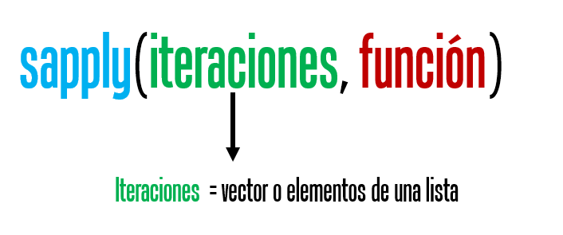
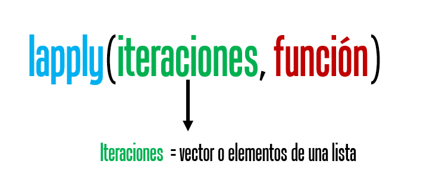
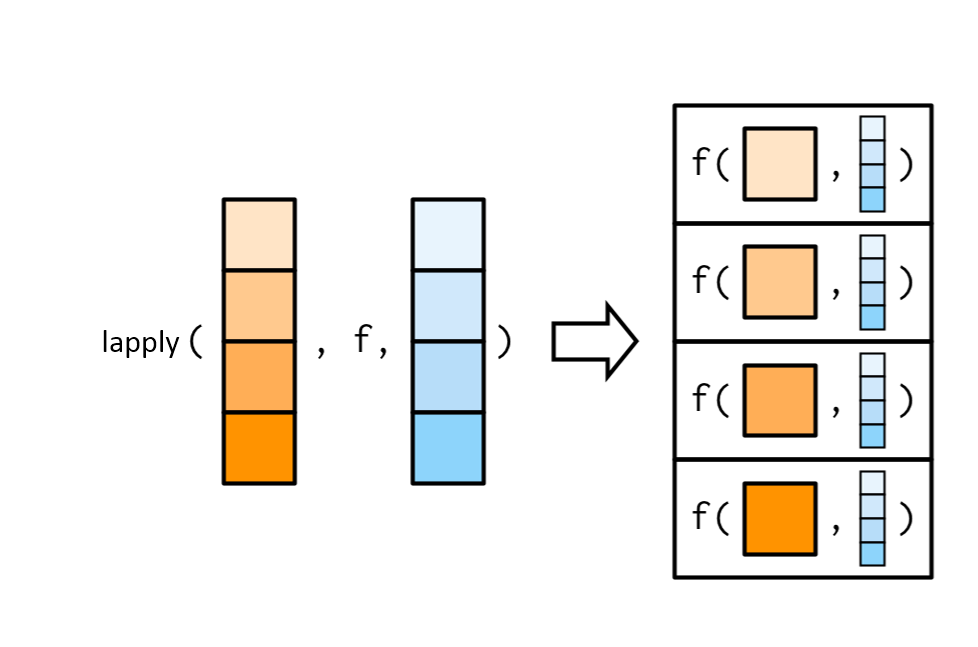

# Loops en R. Funciones base de R

('"Looping", "cycling", "iterating" or just replicating instructions')

Trabajaremos con conjunto de datos llamada iris, la base tiene información sobre el largo y ancho de sépalos y pétalos de 50 flores de tres especies de plantas.


```r
data(iris)
DT::datatable(iris)
```

```{=html}
<div class="datatables html-widget html-fill-item-overflow-hidden html-fill-item" id="htmlwidget-1f75515c045f8c21f199" style="width:100%;height:auto;"></div>
<script type="application/json" data-for="htmlwidget-1f75515c045f8c21f199">{"x":{"filter":"none","data":[["1","2","3","4","5","6","7","8","9","10","11","12","13","14","15","16","17","18","19","20","21","22","23","24","25","26","27","28","29","30","31","32","33","34","35","36","37","38","39","40","41","42","43","44","45","46","47","48","49","50","51","52","53","54","55","56","57","58","59","60","61","62","63","64","65","66","67","68","69","70","71","72","73","74","75","76","77","78","79","80","81","82","83","84","85","86","87","88","89","90","91","92","93","94","95","96","97","98","99","100","101","102","103","104","105","106","107","108","109","110","111","112","113","114","115","116","117","118","119","120","121","122","123","124","125","126","127","128","129","130","131","132","133","134","135","136","137","138","139","140","141","142","143","144","145","146","147","148","149","150"],[5.1,4.9,4.7,4.6,5,5.4,4.6,5,4.4,4.9,5.4,4.8,4.8,4.3,5.8,5.7,5.4,5.1,5.7,5.1,5.4,5.1,4.6,5.1,4.8,5,5,5.2,5.2,4.7,4.8,5.4,5.2,5.5,4.9,5,5.5,4.9,4.4,5.1,5,4.5,4.4,5,5.1,4.8,5.1,4.6,5.3,5,7,6.4,6.9,5.5,6.5,5.7,6.3,4.9,6.6,5.2,5,5.9,6,6.1,5.6,6.7,5.6,5.8,6.2,5.6,5.9,6.1,6.3,6.1,6.4,6.6,6.8,6.7,6,5.7,5.5,5.5,5.8,6,5.4,6,6.7,6.3,5.6,5.5,5.5,6.1,5.8,5,5.6,5.7,5.7,6.2,5.1,5.7,6.3,5.8,7.1,6.3,6.5,7.6,4.9,7.3,6.7,7.2,6.5,6.4,6.8,5.7,5.8,6.4,6.5,7.7,7.7,6,6.9,5.6,7.7,6.3,6.7,7.2,6.2,6.1,6.4,7.2,7.4,7.9,6.4,6.3,6.1,7.7,6.3,6.4,6,6.9,6.7,6.9,5.8,6.8,6.7,6.7,6.3,6.5,6.2,5.9],[3.5,3,3.2,3.1,3.6,3.9,3.4,3.4,2.9,3.1,3.7,3.4,3,3,4,4.4,3.9,3.5,3.8,3.8,3.4,3.7,3.6,3.3,3.4,3,3.4,3.5,3.4,3.2,3.1,3.4,4.1,4.2,3.1,3.2,3.5,3.6,3,3.4,3.5,2.3,3.2,3.5,3.8,3,3.8,3.2,3.7,3.3,3.2,3.2,3.1,2.3,2.8,2.8,3.3,2.4,2.9,2.7,2,3,2.2,2.9,2.9,3.1,3,2.7,2.2,2.5,3.2,2.8,2.5,2.8,2.9,3,2.8,3,2.9,2.6,2.4,2.4,2.7,2.7,3,3.4,3.1,2.3,3,2.5,2.6,3,2.6,2.3,2.7,3,2.9,2.9,2.5,2.8,3.3,2.7,3,2.9,3,3,2.5,2.9,2.5,3.6,3.2,2.7,3,2.5,2.8,3.2,3,3.8,2.6,2.2,3.2,2.8,2.8,2.7,3.3,3.2,2.8,3,2.8,3,2.8,3.8,2.8,2.8,2.6,3,3.4,3.1,3,3.1,3.1,3.1,2.7,3.2,3.3,3,2.5,3,3.4,3],[1.4,1.4,1.3,1.5,1.4,1.7,1.4,1.5,1.4,1.5,1.5,1.6,1.4,1.1,1.2,1.5,1.3,1.4,1.7,1.5,1.7,1.5,1,1.7,1.9,1.6,1.6,1.5,1.4,1.6,1.6,1.5,1.5,1.4,1.5,1.2,1.3,1.4,1.3,1.5,1.3,1.3,1.3,1.6,1.9,1.4,1.6,1.4,1.5,1.4,4.7,4.5,4.9,4,4.6,4.5,4.7,3.3,4.6,3.9,3.5,4.2,4,4.7,3.6,4.4,4.5,4.1,4.5,3.9,4.8,4,4.9,4.7,4.3,4.4,4.8,5,4.5,3.5,3.8,3.7,3.9,5.1,4.5,4.5,4.7,4.4,4.1,4,4.4,4.6,4,3.3,4.2,4.2,4.2,4.3,3,4.1,6,5.1,5.9,5.6,5.8,6.6,4.5,6.3,5.8,6.1,5.1,5.3,5.5,5,5.1,5.3,5.5,6.7,6.9,5,5.7,4.9,6.7,4.9,5.7,6,4.8,4.9,5.6,5.8,6.1,6.4,5.6,5.1,5.6,6.1,5.6,5.5,4.8,5.4,5.6,5.1,5.1,5.9,5.7,5.2,5,5.2,5.4,5.1],[0.2,0.2,0.2,0.2,0.2,0.4,0.3,0.2,0.2,0.1,0.2,0.2,0.1,0.1,0.2,0.4,0.4,0.3,0.3,0.3,0.2,0.4,0.2,0.5,0.2,0.2,0.4,0.2,0.2,0.2,0.2,0.4,0.1,0.2,0.2,0.2,0.2,0.1,0.2,0.2,0.3,0.3,0.2,0.6,0.4,0.3,0.2,0.2,0.2,0.2,1.4,1.5,1.5,1.3,1.5,1.3,1.6,1,1.3,1.4,1,1.5,1,1.4,1.3,1.4,1.5,1,1.5,1.1,1.8,1.3,1.5,1.2,1.3,1.4,1.4,1.7,1.5,1,1.1,1,1.2,1.6,1.5,1.6,1.5,1.3,1.3,1.3,1.2,1.4,1.2,1,1.3,1.2,1.3,1.3,1.1,1.3,2.5,1.9,2.1,1.8,2.2,2.1,1.7,1.8,1.8,2.5,2,1.9,2.1,2,2.4,2.3,1.8,2.2,2.3,1.5,2.3,2,2,1.8,2.1,1.8,1.8,1.8,2.1,1.6,1.9,2,2.2,1.5,1.4,2.3,2.4,1.8,1.8,2.1,2.4,2.3,1.9,2.3,2.5,2.3,1.9,2,2.3,1.8],["setosa","setosa","setosa","setosa","setosa","setosa","setosa","setosa","setosa","setosa","setosa","setosa","setosa","setosa","setosa","setosa","setosa","setosa","setosa","setosa","setosa","setosa","setosa","setosa","setosa","setosa","setosa","setosa","setosa","setosa","setosa","setosa","setosa","setosa","setosa","setosa","setosa","setosa","setosa","setosa","setosa","setosa","setosa","setosa","setosa","setosa","setosa","setosa","setosa","setosa","versicolor","versicolor","versicolor","versicolor","versicolor","versicolor","versicolor","versicolor","versicolor","versicolor","versicolor","versicolor","versicolor","versicolor","versicolor","versicolor","versicolor","versicolor","versicolor","versicolor","versicolor","versicolor","versicolor","versicolor","versicolor","versicolor","versicolor","versicolor","versicolor","versicolor","versicolor","versicolor","versicolor","versicolor","versicolor","versicolor","versicolor","versicolor","versicolor","versicolor","versicolor","versicolor","versicolor","versicolor","versicolor","versicolor","versicolor","versicolor","versicolor","versicolor","virginica","virginica","virginica","virginica","virginica","virginica","virginica","virginica","virginica","virginica","virginica","virginica","virginica","virginica","virginica","virginica","virginica","virginica","virginica","virginica","virginica","virginica","virginica","virginica","virginica","virginica","virginica","virginica","virginica","virginica","virginica","virginica","virginica","virginica","virginica","virginica","virginica","virginica","virginica","virginica","virginica","virginica","virginica","virginica","virginica","virginica","virginica","virginica","virginica","virginica"]],"container":"<table class=\"display\">\n  <thead>\n    <tr>\n      <th> <\/th>\n      <th>Sepal.Length<\/th>\n      <th>Sepal.Width<\/th>\n      <th>Petal.Length<\/th>\n      <th>Petal.Width<\/th>\n      <th>Species<\/th>\n    <\/tr>\n  <\/thead>\n<\/table>","options":{"columnDefs":[{"className":"dt-right","targets":[1,2,3,4]},{"orderable":false,"targets":0}],"order":[],"autoWidth":false,"orderClasses":false}},"evals":[],"jsHooks":[]}</script>
```

## apply()

Aplicas instrucciones a filas o columnas de un data.frame o matriz.

{width="547"}

<video width="500" height="400" controls>

<source src="images/apply_2.mp4" type="video/mp4">

</video>

Si queremos estimar la media de cada una de mis cuatro variables de la tabla iris entonces podría usar lo siguiente:


```r
mean(iris$Sepal.Length)
#> [1] 5.843333

mean(iris$Sepal.Width)
#> [1] 3.057333

mean(iris$Petal.Length)
#> [1] 3.758

mean(iris$Petal.Width)
#> [1] 1.199333
```

**o**


```r
c(mean(iris$Sepal.Length), mean(iris$Sepal.Width), mean(iris$Petal.Length), mean(iris$Petal.Width))
#> [1] 5.843333 3.057333 3.758000 1.199333
```

**oo**


```r
colMeans(iris[,1:4])
#> Sepal.Length  Sepal.Width Petal.Length  Petal.Width 
#>     5.843333     3.057333     3.758000     1.199333
```

**Pero podríamos usar `apply()`**


```r
apply(iris, 2, mean)
#> Warning in mean.default(newX[, i], ...): argument is not
#> numeric or logical: returning NA

#> Warning in mean.default(newX[, i], ...): argument is not
#> numeric or logical: returning NA

#> Warning in mean.default(newX[, i], ...): argument is not
#> numeric or logical: returning NA

#> Warning in mean.default(newX[, i], ...): argument is not
#> numeric or logical: returning NA

#> Warning in mean.default(newX[, i], ...): argument is not
#> numeric or logical: returning NA
#> Sepal.Length  Sepal.Width Petal.Length  Petal.Width 
#>           NA           NA           NA           NA 
#>      Species 
#>           NA
```

**¿Porqué sale error o NA?**

**Para ir tomando ritmo resolvamos los siguientes ejercicios:**

**1) Ahora quiero la raíz cuadrada de la media que previamente es elevada a la 5ta potencia**


```r
apply(iris[,1:4], 2, function(x){
  x.1 <- sqrt(mean(x)^5)
})
#> Sepal.Length  Sepal.Width Petal.Length  Petal.Width 
#>    82.537565    16.343948    27.377383     1.575251
```

**2) El resultado de la raíz cuadrada la quiero multiplicar por 15 y dividir entre 2**

**3) Si el resultado es mayor a 1000 que devuelva un 0**

## for()

Sirve para repetir n veces una o más instrucciones. La estructura es:

{width="547"}

{width="467"}

En el siguiente ejemplo usaremos `for()` para obtener un boxplot para cada variable de pétalo y sépalo.

**Solución 1.**


```r
par(mfrow=c(2,2))
boxplot(iris$Sepal.Length ~ iris$Species, ylab = "Sepal.Length",
        xlab = "Specie")
boxplot(iris$Sepal.Width ~ iris$Species, ylab = "Sepal.Width",
        xlab = "Specie")
boxplot(iris$Petal.Length ~ iris$Species, ylab = "Petal.Length",
        xlab = "Specie")
boxplot(iris$Petal.Width ~ iris$Species, ylab = "Petal.Width",
        xlab = "Specie")
```


**Solución 2.**


```r
par(mfrow=c(2,2))
for(i in 1:4){
  boxplot(iris[[i]] ~ iris$Species, ylab = names(iris)[i], xlab = "Specie")
}
```


Además, podemos crear **vectores, listas o data.frames**, pero previamente debemos crear un **objeto que va a almacenar** nuestra salida de cada iteración (repetición de instrucciones) y que debe tener las propiedades que queremos de salida.

**Vector**


```r
prueba <- vector()
for(i in 1:4){
  prueba[[i]] <- mean(iris[[i]])
}
prueba
#> [1] 5.843333 3.057333 3.758000 1.199333
```

**Data.frame**


```r
prueba <- data.frame(Especie = "", 
                     "MSepal.Length" = 0,
                     "SDSepal.Length" = 0)
prueba
#>   Especie MSepal.Length SDSepal.Length
#> 1                     0              0
# c("setosa", "versicolor", "virginica") = unique(iris$Species)
for(i in 1:3){
  i.1 <- iris[iris$Species == unique(iris$Species)[[i]],]
  prueba[i,] <- data.frame(Especie = as.character(unique(iris$Species)[[i]]), 
                     "MSepal.Length" = mean(i.1$Sepal.Length),
                     "SDSepal.Length" = sd(i.1$Sepal.Length))
}
prueba
#>      Especie MSepal.Length SDSepal.Length
#> 1     setosa         5.006      0.3524897
#> 2 versicolor         5.936      0.5161711
#> 3  virginica         6.588      0.6358796
```

**Lista**


```r
prueba <- list()
# c("setosa", "versicolor", "virginica") = unique(iris$Species)
for(i in 1:3){
  i.1 <- iris[iris$Species == unique(iris$Species)[[i]],]
  prueba[[i]] <- data.frame(Especie = as.character(unique(iris$Species)[[i]]), 
                     "MSepal.Length" = mean(i.1$Sepal.Length),
                     "SDSepal.Length" = sd(i.1$Sepal.Length))
}
prueba
#> [[1]]
#>   Especie MSepal.Length SDSepal.Length
#> 1  setosa         5.006      0.3524897
#> 
#> [[2]]
#>      Especie MSepal.Length SDSepal.Length
#> 1 versicolor         5.936      0.5161711
#> 
#> [[3]]
#>     Especie MSepal.Length SDSepal.Length
#> 1 virginica         6.588      0.6358796
```

Para colapsar la lista en un unico objeto podemos usar la función `do.call()`


```r
prueba <- do.call(rbind, prueba)
prueba
#>      Especie MSepal.Length SDSepal.Length
#> 1     setosa         5.006      0.3524897
#> 2 versicolor         5.936      0.5161711
#> 3  virginica         6.588      0.6358796
```


## sapply()
sapply trabaja con vectores o listas y las salidas usuales pueden ser matrices, con varios array, una lista o un vector, es decir, puede hacer de todo!

{width="547"}


Veamos algunas de sus aplicaciones más comunes.

**1.** Obtener un vector numérico. Estimar la media para cada variable del conjunto de datos iris.


```r
sapply(1:4, function(x){mean(iris[[x]])})
#> [1] 5.843333 3.057333 3.758000 1.199333
```

**2.** Obtener una matriz con arrays que puedes transformar a data.frame. Ojo el resultado de iteración lo agrega en una "columna". 


```r
sapply(1:3, function(x){
  x.1 <- iris[iris$Species == unique(iris$Species)[[x]],]
  x.1 <- c("Especie" = as.character(unique(iris$Species)[[x]]), 
           "MSepal.Length" = mean(x.1$Sepal.Length),
           "SDSepal.Length" = sd(x.1$Sepal.Length))
  return(x.1)
})
#>                [,1]                [,2]               
#> Especie        "setosa"            "versicolor"       
#> MSepal.Length  "5.006"             "5.936"            
#> SDSepal.Length "0.352489687213451" "0.516171147063863"
#>                [,3]               
#> Especie        "virginica"        
#> MSepal.Length  "6.588"            
#> SDSepal.Length "0.635879593274432"
```


Si quiero tener una salida más amigable como un data.frame tendríamos que usar otras funciones, por ejemplo:


```r
library(magrittr)# para usar %>%
sapply(1:3, function(x){
  x.1 <- iris[iris$Species == unique(iris$Species)[[x]],]
  x.1 <- c("Especie" = as.character(unique(iris$Species)[[x]]), 
           "MSepal.Length" = mean(x.1$Sepal.Length),
           "SDSepal.Length" = sd(x.1$Sepal.Length))
  return(x.1)
}) %>% as.data.frame() %>% t() %>% as.data.frame()
#>       Especie MSepal.Length    SDSepal.Length
#> V1     setosa         5.006 0.352489687213451
#> V2 versicolor         5.936 0.516171147063863
#> V3  virginica         6.588 0.635879593274432
```


**3.** Obtener una lista. Se necesita que las salidas tengan dimensiones distintas, de lo contrario lo juntara en una matriz. 


```r
sapply(3:9, seq)
#> [[1]]
#> [1] 1 2 3
#> 
#> [[2]]
#> [1] 1 2 3 4
#> 
#> [[3]]
#> [1] 1 2 3 4 5
#> 
#> [[4]]
#> [1] 1 2 3 4 5 6
#> 
#> [[5]]
#> [1] 1 2 3 4 5 6 7
#> 
#> [[6]]
#> [1] 1 2 3 4 5 6 7 8
#> 
#> [[7]]
#> [1] 1 2 3 4 5 6 7 8 9
```


```r
sapply(1:3, function(x){
  x.1 <- iris[iris$Species == unique(iris$Species)[[x]],]
  if(unique(x.1$Species) == "setosa"){
  x.1 <- c("Especie" = as.character(unique(iris$Species)[[x]]), 
           "MSepal.Length" = mean(x.1$Sepal.Length))  
  } else {
  x.1 <- c("Especie" = as.character(unique(iris$Species)[[x]]), 
           "MSepal.Length" = mean(x.1$Sepal.Length),
           "SDSepal.Length" = sd(x.1$Sepal.Length))  
  }
  
  return(x.1)
})
#> [[1]]
#>       Especie MSepal.Length 
#>      "setosa"       "5.006" 
#> 
#> [[2]]
#>             Especie       MSepal.Length      SDSepal.Length 
#>        "versicolor"             "5.936" "0.516171147063863" 
#> 
#> [[3]]
#>             Especie       MSepal.Length      SDSepal.Length 
#>         "virginica"             "6.588" "0.635879593274432"
```


## tapply()
La función tapply() aplica una función a un vector *x* y agrupa la salida de acuerdo con un vector *y* del mismo largo. El vector *y* es categórico e idealmente debe tener distintos niveles de factor. 


{width="547"}


Ejemplo. 


```r
tapply(iris$Sepal.Width, iris$Species, mean)
#>     setosa versicolor  virginica 
#>      3.428      2.770      2.974
```

## mapply()

La función mapply() puede ser usada bajo la misma logica de sapply pero usando más de un vector. Los vectores iteractuan por posición, es decir, el primer elemento del vector y y el vector 2, seguido del segundo elemento del vector 1 y vector 2, etc.


{width="547"}


Ejemplos:


```r
mapply(mean, iris$Sepal.Length, iris$Petal.Length)
#>   [1] 5.1 4.9 4.7 4.6 5.0 5.4 4.6 5.0 4.4 4.9 5.4 4.8 4.8
#>  [14] 4.3 5.8 5.7 5.4 5.1 5.7 5.1 5.4 5.1 4.6 5.1 4.8 5.0
#>  [27] 5.0 5.2 5.2 4.7 4.8 5.4 5.2 5.5 4.9 5.0 5.5 4.9 4.4
#>  [40] 5.1 5.0 4.5 4.4 5.0 5.1 4.8 5.1 4.6 5.3 5.0 7.0 6.4
#>  [53] 6.9 5.5 6.5 5.7 6.3 4.9 6.6 5.2 5.0 5.9 6.0 6.1 5.6
#>  [66] 6.7 5.6 5.8 6.2 5.6 5.9 6.1 6.3 6.1 6.4 6.6 6.8 6.7
#>  [79] 6.0 5.7 5.5 5.5 5.8 6.0 5.4 6.0 6.7 6.3 5.6 5.5 5.5
#>  [92] 6.1 5.8 5.0 5.6 5.7 5.7 6.2 5.1 5.7 6.3 5.8 7.1 6.3
#> [105] 6.5 7.6 4.9 7.3 6.7 7.2 6.5 6.4 6.8 5.7 5.8 6.4 6.5
#> [118] 7.7 7.7 6.0 6.9 5.6 7.7 6.3 6.7 7.2 6.2 6.1 6.4 7.2
#> [131] 7.4 7.9 6.4 6.3 6.1 7.7 6.3 6.4 6.0 6.9 6.7 6.9 5.8
#> [144] 6.8 6.7 6.7 6.3 6.5 6.2 5.9

mapply(sum, iris$Sepal.Length, iris$Petal.Length, iris$Sepal.Width)
#>   [1] 10.0  9.3  9.2  9.2 10.0 11.0  9.4  9.9  8.7  9.5 10.6
#>  [12]  9.8  9.2  8.4 11.0 11.6 10.6 10.0 11.2 10.4 10.5 10.3
#>  [23]  9.2 10.1 10.1  9.6 10.0 10.2 10.0  9.5  9.5 10.3 10.8
#>  [34] 11.1  9.5  9.4 10.3  9.9  8.7 10.0  9.8  8.1  8.9 10.1
#>  [45] 10.8  9.2 10.5  9.2 10.5  9.7 14.9 14.1 14.9 11.8 13.9
#>  [56] 13.0 14.3 10.6 14.1 11.8 10.5 13.1 12.2 13.7 12.1 14.2
#>  [67] 13.1 12.6 12.9 12.0 13.9 12.9 13.7 13.6 13.6 14.0 14.4
#>  [78] 14.7 13.4 11.8 11.7 11.6 12.4 13.8 12.9 13.9 14.5 13.0
#>  [89] 12.7 12.0 12.5 13.7 12.4 10.6 12.5 12.9 12.8 13.4 10.6
#> [100] 12.6 15.6 13.6 16.0 14.8 15.3 17.2 11.9 16.5 15.0 16.9
#> [111] 14.8 14.4 15.3 13.2 13.7 14.9 15.0 18.2 17.2 13.2 15.8
#> [122] 13.3 17.2 13.9 15.7 16.4 13.8 14.0 14.8 16.0 16.3 18.1
#> [133] 14.8 14.2 14.3 16.8 15.3 15.0 13.8 15.4 15.4 15.1 13.6
#> [144] 15.9 15.7 14.9 13.8 14.7 15.0 14.0
```

O podría hacer una función:


```r
f <- function(a,b,c) a+b/c

mapply(f, iris$Sepal.Length, iris$Petal.Length, iris$Sepal.Width)
#>   [1]  5.500000  5.366667  5.106250  5.083871  5.388889
#>   [6]  5.835897  5.011765  5.441176  4.882759  5.383871
#>  [11]  5.805405  5.270588  5.266667  4.666667  6.100000
#>  [16]  6.040909  5.733333  5.500000  6.147368  5.494737
#>  [21]  5.900000  5.505405  4.877778  5.615152  5.358824
#>  [26]  5.533333  5.470588  5.628571  5.611765  5.200000
#>  [31]  5.316129  5.841176  5.565854  5.833333  5.383871
#>  [36]  5.375000  5.871429  5.288889  4.833333  5.541176
#>  [41]  5.371429  5.065217  4.806250  5.457143  5.600000
#>  [46]  5.266667  5.521053  5.037500  5.705405  5.424242
#>  [51]  8.468750  7.806250  8.480645  7.239130  8.142857
#>  [56]  7.307143  7.724242  6.275000  8.186207  6.644444
#>  [61]  6.750000  7.300000  7.818182  7.720690  6.841379
#>  [66]  8.119355  7.100000  7.318519  8.245455  7.160000
#>  [71]  7.400000  7.528571  8.260000  7.778571  7.882759
#>  [76]  8.066667  8.514286  8.366667  7.551724  7.046154
#>  [81]  7.083333  7.041667  7.244444  7.888889  6.900000
#>  [86]  7.323529  8.216129  8.213043  6.966667  7.100000
#>  [91]  7.192308  7.633333  7.338462  6.434783  7.155556
#>  [96]  7.100000  7.148276  7.682759  6.300000  7.164286
#> [101]  8.118182  7.688889  9.066667  8.231034  8.433333
#> [106]  9.800000  6.700000  9.472414  9.020000  8.894444
#> [111]  8.093750  8.362963  8.633333  7.700000  7.621429
#> [116]  8.056250  8.333333  9.463158 10.353846  8.272727
#> [121]  8.681250  7.350000 10.092857  8.114815  8.427273
#> [126]  9.075000  7.914286  7.733333  8.400000  9.133333
#> [131]  9.578571  9.584211  8.400000  8.121429  8.253846
#> [136]  9.733333  7.947059  8.174194  7.600000  8.641935
#> [141]  8.506452  8.545161  7.688889  8.643750  8.427273
#> [146]  8.433333  8.300000  8.233333  7.788235  7.600000
```


## lapply()

La función lapply es una de las funciones más usadas en R, permite realizar iteraciones sobre una lista, array o vector y devuelve siempre una lista. Esto tiene varias ventajas, por ejemplo, que puedes guardar cualquier tipo clase de R.


{width="547"}


{width="547"}


**Vector**

```r
lapply(1:3, function(x){
  x.1 <- iris[iris$Species == unique(iris$Species)[[x]],]
  
  x.1 <- c("Especie" = as.character(unique(iris$Species)[[x]]), 
           "MSepal.Length" = mean(x.1$Sepal.Length),
           "SDSepal.Length" = sd(x.1$Sepal.Length))  
  
  return(x.1)
})
#> [[1]]
#>             Especie       MSepal.Length      SDSepal.Length 
#>            "setosa"             "5.006" "0.352489687213451" 
#> 
#> [[2]]
#>             Especie       MSepal.Length      SDSepal.Length 
#>        "versicolor"             "5.936" "0.516171147063863" 
#> 
#> [[3]]
#>             Especie       MSepal.Length      SDSepal.Length 
#>         "virginica"             "6.588" "0.635879593274432"
```

**Data.frame**

```r
lapply(1:3, function(x){
  x.1 <- iris[iris$Species == unique(iris$Species)[[x]],]
  x.1 <- data.frame("Especie" = as.character(unique(iris$Species)[[x]]), 
           "MSepal.Length" = mean(x.1$Sepal.Length),
           "SDSepal.Length" = sd(x.1$Sepal.Length))  
  
  return(x.1)
})
#> [[1]]
#>   Especie MSepal.Length SDSepal.Length
#> 1  setosa         5.006      0.3524897
#> 
#> [[2]]
#>      Especie MSepal.Length SDSepal.Length
#> 1 versicolor         5.936      0.5161711
#> 
#> [[3]]
#>     Especie MSepal.Length SDSepal.Length
#> 1 virginica         6.588      0.6358796
```
  
 
Para colapsar la lista en un unico data.frame podemos usar la función `do.call()`


```r
lapply(1:3, function(x){
  x.1 <- iris[iris$Species == unique(iris$Species)[[x]],]
  x.1 <- data.frame("Especie" = as.character(unique(iris$Species)[[x]]), 
           "MSepal.Length" = mean(x.1$Sepal.Length),
           "SDSepal.Length" = sd(x.1$Sepal.Length))  
  
  return(x.1)
}) %>% do.call(rbind, .)
#>      Especie MSepal.Length SDSepal.Length
#> 1     setosa         5.006      0.3524897
#> 2 versicolor         5.936      0.5161711
#> 3  virginica         6.588      0.6358796
```


  
**lista**

```r
lapply(1:3, function(x){
  x.1 <- iris[iris$Species == unique(iris$Species)[[x]],]
  
  x.1 <- list("Especie" = as.character(unique(iris$Species)[[x]]), 
           "MSepal.Length" = mean(x.1$Sepal.Length),
           "SDSepal.Length" = sd(x.1$Sepal.Length))  
  
  return(x.1)
})
#> [[1]]
#> [[1]]$Especie
#> [1] "setosa"
#> 
#> [[1]]$MSepal.Length
#> [1] 5.006
#> 
#> [[1]]$SDSepal.Length
#> [1] 0.3524897
#> 
#> 
#> [[2]]
#> [[2]]$Especie
#> [1] "versicolor"
#> 
#> [[2]]$MSepal.Length
#> [1] 5.936
#> 
#> [[2]]$SDSepal.Length
#> [1] 0.5161711
#> 
#> 
#> [[3]]
#> [[3]]$Especie
#> [1] "virginica"
#> 
#> [[3]]$MSepal.Length
#> [1] 6.588
#> 
#> [[3]]$SDSepal.Length
#> [1] 0.6358796
```


## repeat{}

Repite instrucciones hasta cumplir una condición. AL cumplir la condición se rompe el loop usando *break*. 


{width="547"}


Ejemplo. 


```r
resultado <- vector()
y = 1

repeat{
  if(y > 1){
    x <- sum(c(resultado[1:(y-1)], iris$Sepal.Length[y] + iris$Petal.Length[y]))  
  } else {
   x <- iris$Sepal.Length[y] + iris$Petal.Length[y]  
  }
  
  if(x > 100){
    break
  } else {
    resultado[[y]] <- x
    y <- y + 1
  }
}
```


