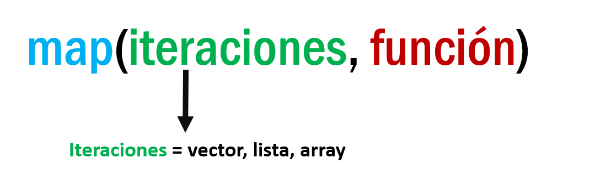
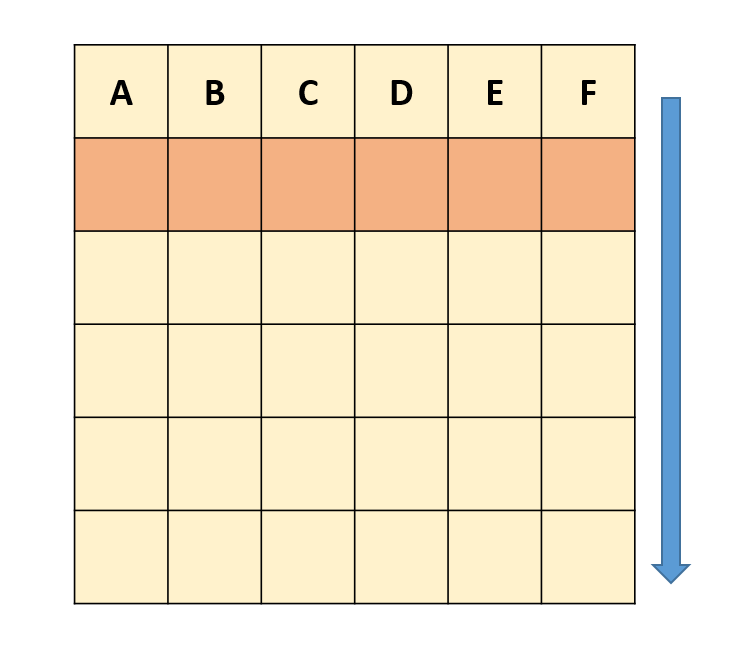
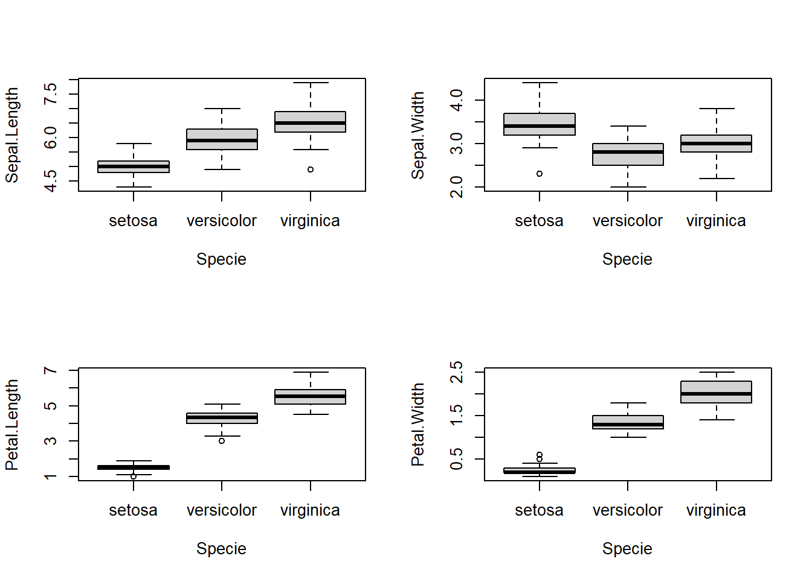

# Loops en R. Paquete purrr

{width="300"}

El paquete **purrr** tiene funciones útiles para seguir implementando la programación funcional en donde la filosofía a grandes rasgos es optimizar código quitando redundancia aplicando loops.  

https://github.com/rstudio/cheatsheets/blob/main/purrr.pdf

Debemos instalar el paquete **purrr**:


```r
install.packages("purrr", dependencies = TRUE)
```

Seguiremos usando el conjunto de datos llamado **iris**:


```r
data(iris)
DT::datatable(iris)
```

```{=html}
<div class="datatables html-widget html-fill-item-overflow-hidden html-fill-item" id="htmlwidget-983c0643d260f6f69bba" style="width:100%;height:auto;"></div>
<script type="application/json" data-for="htmlwidget-983c0643d260f6f69bba">{"x":{"filter":"none","data":[["1","2","3","4","5","6","7","8","9","10","11","12","13","14","15","16","17","18","19","20","21","22","23","24","25","26","27","28","29","30","31","32","33","34","35","36","37","38","39","40","41","42","43","44","45","46","47","48","49","50","51","52","53","54","55","56","57","58","59","60","61","62","63","64","65","66","67","68","69","70","71","72","73","74","75","76","77","78","79","80","81","82","83","84","85","86","87","88","89","90","91","92","93","94","95","96","97","98","99","100","101","102","103","104","105","106","107","108","109","110","111","112","113","114","115","116","117","118","119","120","121","122","123","124","125","126","127","128","129","130","131","132","133","134","135","136","137","138","139","140","141","142","143","144","145","146","147","148","149","150"],[5.1,4.9,4.7,4.6,5,5.4,4.6,5,4.4,4.9,5.4,4.8,4.8,4.3,5.8,5.7,5.4,5.1,5.7,5.1,5.4,5.1,4.6,5.1,4.8,5,5,5.2,5.2,4.7,4.8,5.4,5.2,5.5,4.9,5,5.5,4.9,4.4,5.1,5,4.5,4.4,5,5.1,4.8,5.1,4.6,5.3,5,7,6.4,6.9,5.5,6.5,5.7,6.3,4.9,6.6,5.2,5,5.9,6,6.1,5.6,6.7,5.6,5.8,6.2,5.6,5.9,6.1,6.3,6.1,6.4,6.6,6.8,6.7,6,5.7,5.5,5.5,5.8,6,5.4,6,6.7,6.3,5.6,5.5,5.5,6.1,5.8,5,5.6,5.7,5.7,6.2,5.1,5.7,6.3,5.8,7.1,6.3,6.5,7.6,4.9,7.3,6.7,7.2,6.5,6.4,6.8,5.7,5.8,6.4,6.5,7.7,7.7,6,6.9,5.6,7.7,6.3,6.7,7.2,6.2,6.1,6.4,7.2,7.4,7.9,6.4,6.3,6.1,7.7,6.3,6.4,6,6.9,6.7,6.9,5.8,6.8,6.7,6.7,6.3,6.5,6.2,5.9],[3.5,3,3.2,3.1,3.6,3.9,3.4,3.4,2.9,3.1,3.7,3.4,3,3,4,4.4,3.9,3.5,3.8,3.8,3.4,3.7,3.6,3.3,3.4,3,3.4,3.5,3.4,3.2,3.1,3.4,4.1,4.2,3.1,3.2,3.5,3.6,3,3.4,3.5,2.3,3.2,3.5,3.8,3,3.8,3.2,3.7,3.3,3.2,3.2,3.1,2.3,2.8,2.8,3.3,2.4,2.9,2.7,2,3,2.2,2.9,2.9,3.1,3,2.7,2.2,2.5,3.2,2.8,2.5,2.8,2.9,3,2.8,3,2.9,2.6,2.4,2.4,2.7,2.7,3,3.4,3.1,2.3,3,2.5,2.6,3,2.6,2.3,2.7,3,2.9,2.9,2.5,2.8,3.3,2.7,3,2.9,3,3,2.5,2.9,2.5,3.6,3.2,2.7,3,2.5,2.8,3.2,3,3.8,2.6,2.2,3.2,2.8,2.8,2.7,3.3,3.2,2.8,3,2.8,3,2.8,3.8,2.8,2.8,2.6,3,3.4,3.1,3,3.1,3.1,3.1,2.7,3.2,3.3,3,2.5,3,3.4,3],[1.4,1.4,1.3,1.5,1.4,1.7,1.4,1.5,1.4,1.5,1.5,1.6,1.4,1.1,1.2,1.5,1.3,1.4,1.7,1.5,1.7,1.5,1,1.7,1.9,1.6,1.6,1.5,1.4,1.6,1.6,1.5,1.5,1.4,1.5,1.2,1.3,1.4,1.3,1.5,1.3,1.3,1.3,1.6,1.9,1.4,1.6,1.4,1.5,1.4,4.7,4.5,4.9,4,4.6,4.5,4.7,3.3,4.6,3.9,3.5,4.2,4,4.7,3.6,4.4,4.5,4.1,4.5,3.9,4.8,4,4.9,4.7,4.3,4.4,4.8,5,4.5,3.5,3.8,3.7,3.9,5.1,4.5,4.5,4.7,4.4,4.1,4,4.4,4.6,4,3.3,4.2,4.2,4.2,4.3,3,4.1,6,5.1,5.9,5.6,5.8,6.6,4.5,6.3,5.8,6.1,5.1,5.3,5.5,5,5.1,5.3,5.5,6.7,6.9,5,5.7,4.9,6.7,4.9,5.7,6,4.8,4.9,5.6,5.8,6.1,6.4,5.6,5.1,5.6,6.1,5.6,5.5,4.8,5.4,5.6,5.1,5.1,5.9,5.7,5.2,5,5.2,5.4,5.1],[0.2,0.2,0.2,0.2,0.2,0.4,0.3,0.2,0.2,0.1,0.2,0.2,0.1,0.1,0.2,0.4,0.4,0.3,0.3,0.3,0.2,0.4,0.2,0.5,0.2,0.2,0.4,0.2,0.2,0.2,0.2,0.4,0.1,0.2,0.2,0.2,0.2,0.1,0.2,0.2,0.3,0.3,0.2,0.6,0.4,0.3,0.2,0.2,0.2,0.2,1.4,1.5,1.5,1.3,1.5,1.3,1.6,1,1.3,1.4,1,1.5,1,1.4,1.3,1.4,1.5,1,1.5,1.1,1.8,1.3,1.5,1.2,1.3,1.4,1.4,1.7,1.5,1,1.1,1,1.2,1.6,1.5,1.6,1.5,1.3,1.3,1.3,1.2,1.4,1.2,1,1.3,1.2,1.3,1.3,1.1,1.3,2.5,1.9,2.1,1.8,2.2,2.1,1.7,1.8,1.8,2.5,2,1.9,2.1,2,2.4,2.3,1.8,2.2,2.3,1.5,2.3,2,2,1.8,2.1,1.8,1.8,1.8,2.1,1.6,1.9,2,2.2,1.5,1.4,2.3,2.4,1.8,1.8,2.1,2.4,2.3,1.9,2.3,2.5,2.3,1.9,2,2.3,1.8],["setosa","setosa","setosa","setosa","setosa","setosa","setosa","setosa","setosa","setosa","setosa","setosa","setosa","setosa","setosa","setosa","setosa","setosa","setosa","setosa","setosa","setosa","setosa","setosa","setosa","setosa","setosa","setosa","setosa","setosa","setosa","setosa","setosa","setosa","setosa","setosa","setosa","setosa","setosa","setosa","setosa","setosa","setosa","setosa","setosa","setosa","setosa","setosa","setosa","setosa","versicolor","versicolor","versicolor","versicolor","versicolor","versicolor","versicolor","versicolor","versicolor","versicolor","versicolor","versicolor","versicolor","versicolor","versicolor","versicolor","versicolor","versicolor","versicolor","versicolor","versicolor","versicolor","versicolor","versicolor","versicolor","versicolor","versicolor","versicolor","versicolor","versicolor","versicolor","versicolor","versicolor","versicolor","versicolor","versicolor","versicolor","versicolor","versicolor","versicolor","versicolor","versicolor","versicolor","versicolor","versicolor","versicolor","versicolor","versicolor","versicolor","versicolor","virginica","virginica","virginica","virginica","virginica","virginica","virginica","virginica","virginica","virginica","virginica","virginica","virginica","virginica","virginica","virginica","virginica","virginica","virginica","virginica","virginica","virginica","virginica","virginica","virginica","virginica","virginica","virginica","virginica","virginica","virginica","virginica","virginica","virginica","virginica","virginica","virginica","virginica","virginica","virginica","virginica","virginica","virginica","virginica","virginica","virginica","virginica","virginica","virginica","virginica"]],"container":"<table class=\"display\">\n  <thead>\n    <tr>\n      <th> <\/th>\n      <th>Sepal.Length<\/th>\n      <th>Sepal.Width<\/th>\n      <th>Petal.Length<\/th>\n      <th>Petal.Width<\/th>\n      <th>Species<\/th>\n    <\/tr>\n  <\/thead>\n<\/table>","options":{"columnDefs":[{"className":"dt-right","targets":[1,2,3,4]},{"orderable":false,"targets":0}],"order":[],"autoWidth":false,"orderClasses":false}},"evals":[],"jsHooks":[]}</script>
```


## map() 

La función `map` es el simil de `lapply` y es una de las funciones más usadas en **purrr**. La función permite realizar iteraciones sobre una *lista, array o vector* y devuelve siempre una lista. Esto tiene varias ventajas, por ejemplo, que puedes guardar cualquier clase de R.


{width="547"}

{width="547"}


```r
library(purrr)
```


**Vector como iteración**


```r
entrada <- 1:3
map(entrada, function(x){
  x.1 <- iris[iris$Species == unique(iris$Species)[[x]],]
  
  x.1 <- c("Especie" = as.character(unique(iris$Species)[[x]]), 
           "MSepal.Length" = mean(x.1$Sepal.Length),
           "SDSepal.Length" = sd(x.1$Sepal.Length))  
  
  return(x.1)
})
#> [[1]]
#>             Especie       MSepal.Length      SDSepal.Length 
#>            "setosa"             "5.006" "0.352489687213451" 
#> 
#> [[2]]
#>             Especie       MSepal.Length      SDSepal.Length 
#>        "versicolor"             "5.936" "0.516171147063863" 
#> 
#> [[3]]
#>             Especie       MSepal.Length      SDSepal.Length 
#>         "virginica"             "6.588" "0.635879593274432"
```


**lista como iteración**

Imaginemos que previamente hice un proceso donde separé las filas de cada especie y las guardé por separado en una lista.


```r
entrada <- iris %>% split(iris$Species)
names(entrada)
#> [1] "setosa"     "versicolor" "virginica"
class(entrada)
#> [1] "list"
```


Ahora la lista tiene tres data.frames con los datos de cada especie y la usaremos como entrada en la función map. La lista tiene 3 elementos por lo que hará 3 iteraciones. En la iteración 1 tomará el primer data.frame de la lista, en la iteración 2 el segundo data.frame de la lista y en la iteración 3 tomará el tercer data.frame de la lista. 


```r
ejemplo <- map(entrada, function(x){
  x.1 <- data.frame("Especie" = as.character(unique(x$Species)), 
           "MSepal.Length" = mean(x$Sepal.Length),
           "SDSepal.Length" = sd(x$Sepal.Length))  
  return(x.1)
})

ejemplo
#> $setosa
#>   Especie MSepal.Length SDSepal.Length
#> 1  setosa         5.006      0.3524897
#> 
#> $versicolor
#>      Especie MSepal.Length SDSepal.Length
#> 1 versicolor         5.936      0.5161711
#> 
#> $virginica
#>     Especie MSepal.Length SDSepal.Length
#> 1 virginica         6.588      0.6358796
```


**Colapsar la lista**

Ya que la lista de salida tiene data.frames con columnas con el mismo nombre podemos colapsarlos en un único data.frame usando la función do.call() y rbind(), la ultima indica de que forma se puede colapsar la lista en este caso rbind indica que las apile por filas, de tal forma que las columnas se mantienen integras y lo único que incrementa son las filas.

{width="547"}

{width="547"}


Antes es importante quitar los NULL. En ocasiones cuando algo no ocurre como deseamos en lugar de dejar que falle el loop guardamos el resultado como un NULL, así sabemos que los NULL dentro de nuestra lista son errores. Por ejemplo, supongamos que no queremos tener información de setosa porque sabemos que la información es incorrecta, así que aplicaremos una iteración y cuando lleguemos a esa especie devolverá un NULL. 


```r
ejemplo <- map(entrada, function(x){
  if(unique(x$Species) == "setosa"){
    x.1 <- NULL
  } else {
  x.1 <- data.frame("Especie" = as.character(unique(x$Species)), 
           "MSepal.Length" = mean(x$Sepal.Length),
           "SDSepal.Length" = sd(x$Sepal.Length))    
  }
  
  return(x.1)
})
ejemplo
#> $setosa
#> NULL
#> 
#> $versicolor
#>      Especie MSepal.Length SDSepal.Length
#> 1 versicolor         5.936      0.5161711
#> 
#> $virginica
#>     Especie MSepal.Length SDSepal.Length
#> 1 virginica         6.588      0.6358796
```

Ahora antes de hacer un `do.call()` necesitamos quitar el elemento NULL de nuestra lista. En este ejemplo es sencillo porque tenemos solo tres elementos pero imaginemos su importancia cuando tengamos docenas, cientos o miles de elementos en nuestra lista. 

Para quitar los NULL podemos recurrir a las funciones base de R:


```r
Filter(Negate(is.null), ejemplo)
#> $versicolor
#>      Especie MSepal.Length SDSepal.Length
#> 1 versicolor         5.936      0.5161711
#> 
#> $virginica
#>     Especie MSepal.Length SDSepal.Length
#> 1 virginica         6.588      0.6358796
```


O podemos usar la función `compact` de purrr


```r
compact(ejemplo)
#> $versicolor
#>      Especie MSepal.Length SDSepal.Length
#> 1 versicolor         5.936      0.5161711
#> 
#> $virginica
#>     Especie MSepal.Length SDSepal.Length
#> 1 virginica         6.588      0.6358796
```


```r
ejemplo <- compact(ejemplo)
do.call(rbind, ejemplo)
#>               Especie MSepal.Length SDSepal.Length
#> versicolor versicolor         5.936      0.5161711
#> virginica   virginica         6.588      0.6358796
```

También podríamos colapsar la lista por columnas usando la función cbind, de tal forma que la única fila que tenemos se queda integra y lo que cambia es el no. de columnas. 


```r
do.call(cbind, ejemplo)
#>   versicolor.Especie versicolor.MSepal.Length
#> 1         versicolor                    5.936
#>   versicolor.SDSepal.Length virginica.Especie
#> 1                 0.5161711         virginica
#>   virginica.MSepal.Length virginica.SDSepal.Length
#> 1                   6.588                0.6358796
```


## map_dfr y map_dfc

Para ahorrarnos el paso de usar la función `do.call()` para colapsar las listas en un data.frame podemos usar las funciones `map_dfr()` y `map_dfc()`. 

Es igual a la función map (i.e., tiene la misma estructura y trabaja con vectores, listas, arrays) pero la salida siempre es un **data.frame** lo que implica que en las instrucciones que aplicas en cada iteración el resultado siempre debe ser un **data.frame**. Si la salida es un vector numérico, un vector de caracteres, una lista, array u otra clase entonces te marcará un error.


#### **map_dfr()**
En nuestro ejemplo anterior, esta función sustituye el `do.call(rbind, ejemplo)`. 
**Nota**. Dejaremos setosa. 


{width="200"}


**Usando una lista**

```r
map_dfr(entrada, function(x){
  x.1 <- data.frame("Especie" = as.character(unique(x$Species)), 
           "MSepal.Length" = mean(x$Sepal.Length),
           "SDSepal.Length" = sd(x$Sepal.Length))  
  return(x.1)
})
#>      Especie MSepal.Length SDSepal.Length
#> 1     setosa         5.006      0.3524897
#> 2 versicolor         5.936      0.5161711
#> 3  virginica         6.588      0.6358796
```


**Usando un vector**

```r
map_dfr(1:3, function(x){
  x.1 <- iris[iris$Species == unique(iris$Species)[[x]],]
  
  x.1 <- c("Especie" = as.character(unique(iris$Species)[[x]]), 
           "MSepal.Length" = mean(x.1$Sepal.Length),
           "SDSepal.Length" = sd(x.1$Sepal.Length))  
  
  return(x.1)
})
#> # A tibble: 3 x 3
#>   Especie    MSepal.Length SDSepal.Length   
#>   <chr>      <chr>         <chr>            
#> 1 setosa     5.006         0.352489687213451
#> 2 versicolor 5.936         0.516171147063863
#> 3 virginica  6.588         0.635879593274432
```


### **map_dfc()**
En nuestro ejemplo anterior, esta función sustituye el `do.call(cbind, ejemplo)`. 


{width="200"}

**Usando una lista**

```r
map_dfc(entrada, function(x){
  x.1 <- data.frame("Especie" = as.character(unique(x$Species)), 
           "MSepal.Length" = mean(x$Sepal.Length),
           "SDSepal.Length" = sd(x$Sepal.Length))  
  return(x.1)
})
#> New names:
#> * `Especie` -> `Especie...1`
#> * `MSepal.Length` -> `MSepal.Length...2`
#> * `SDSepal.Length` -> `SDSepal.Length...3`
#> * `Especie` -> `Especie...4`
#> * `MSepal.Length` -> `MSepal.Length...5`
#> * `SDSepal.Length` -> `SDSepal.Length...6`
#> * `Especie` -> `Especie...7`
#> * `MSepal.Length` -> `MSepal.Length...8`
#> * `SDSepal.Length` -> `SDSepal.Length...9`
#>   Especie...1 MSepal.Length...2 SDSepal.Length...3
#> 1      setosa             5.006          0.3524897
#>   Especie...4 MSepal.Length...5 SDSepal.Length...6
#> 1  versicolor             5.936          0.5161711
#>   Especie...7 MSepal.Length...8 SDSepal.Length...9
#> 1   virginica             6.588          0.6358796
```


**Usando un vector**

```r
map_dfc(1:3, function(x){
  x.1 <- iris[iris$Species == unique(iris$Species)[[x]],]
  
  x.1 <- c("Especie" = as.character(unique(iris$Species)[[x]]), 
           "MSepal.Length" = mean(x.1$Sepal.Length),
           "SDSepal.Length" = sd(x.1$Sepal.Length))  
  
  return(x.1)
})
#> New names:
#> * `` -> `...1`
#> * `` -> `...2`
#> * `` -> `...3`
#> # A tibble: 3 x 3
#>   ...1              ...2              ...3             
#>   <chr>             <chr>             <chr>            
#> 1 setosa            versicolor        virginica        
#> 2 5.006             5.936             6.588            
#> 3 0.352489687213451 0.516171147063863 0.635879593274432
```


**¿Y si tenemos NULL de salida o un error en el proceso?**


## map_dbl, map_chr y map_lgl

Este grupo de funciones realiza iteraciones sobre una *lista, array o vector* y devuelve **siempre un vector** numérico (map_dbl), carácter (map_chr) o lógico (map_lgl). 

{width="200"}


### **map_dbl()**

```r
map_dbl(1:4, function(x){
  x.1 <- sqrt(mean(iris[[x]])^5)
  return(x.1)
})
#> [1] 82.537565 16.343948 27.377383  1.575251
```

### **map_chr()**


```r
map_chr(entrada, function(x){
  x.1 <- unique(as.character(unique(x$Species)))
  return(x.1)
})
#>       setosa   versicolor    virginica 
#>     "setosa" "versicolor"  "virginica"
```


### **map_lgl()**


```r
map_lgl(entrada, function(x){
  x.1 <- unique(as.character(unique(x$Species))) == "setosa"
  return(x.1)
})
#>     setosa versicolor  virginica 
#>       TRUE      FALSE      FALSE
```

## walk()

La función Walk() es igual que map pero el resultado no se muestra, es útil cuando en cada iteración guardas, gráficas imprimir algo y no tienes interés en crear un objeto nuevo que gaste memoria RAM.


{width="200"}


```r
par(mfrow=c(2,2))
walk(1:4, function(i){
 boxplot(iris[[i]] ~ iris$Species, ylab = names(iris)[i], xlab = "Specie")
})
```




```r
par(mfrow=c(2,2))
walk(1:4, function(i){
 print(i)
})
#> [1] 1
#> [1] 2
#> [1] 3
#> [1] 4
```


Sería el equivalente a la siguiente instrucción usando funciones base de R:


```r
invisible(lapply(1:4, function(i){
    print(i)
}))
#> [1] 1
#> [1] 2
#> [1] 3
#> [1] 4
```
